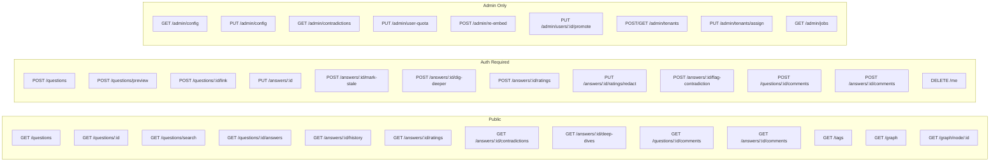

# API Reference

## Authentication

All endpoints marked **Auth** require a `Authorization: Bearer <token>` header.
Endpoints marked **Admin** require the user to have `role=admin`.

## Route Map



## Endpoints

### Health

| Method | Path | Auth | Description |
|--------|------|------|-------------|
| GET | `/health` | No | Health check |

### Auth

| Method | Path | Auth | Description |
|--------|------|------|-------------|
| GET | `/auth/github` | No | Start GitHub OAuth flow |
| GET | `/auth/github/callback` | No | OAuth callback (returns JWT) |
| GET | `/me` | Yes | Current user profile |
| DELETE | `/me` | Yes | Delete account (anonymizes contributions, scrubs PII) |

### Questions

| Method | Path | Auth | Description |
|--------|------|------|-------------|
| POST | `/questions` | Yes | Create a question |
| GET | `/questions` | No | List all questions (paginated) |
| GET | `/questions/:id` | No | Get a question |
| GET | `/questions/search?q=&tags=&limit=&offset=` | No | Hybrid search (BM25 + vector + RRF), optional tag filter |
| POST | `/questions/preview` | Yes | Preview matches + LLM-rephrased query |
| POST | `/questions/:id/link` | Yes | Manually link two questions |
| POST | `/questions/:id/comments` | Yes | Comment on a question |
| GET | `/questions/:id/comments` | No | Get question comments (paginated) |

### Answers

| Method | Path | Auth | Description |
|--------|------|------|-------------|
| GET | `/questions/:id/answers` | No | Get answers for a question |
| PUT | `/answers/:id` | Yes | Edit an answer (stores unified diff) |
| GET | `/answers/:id/history` | No | Edit history with diffs (paginated) |
| POST | `/answers/:id/mark-stale` | Yes | Mark answer as stale/deprecated (triggers auto-resolve if configured) |
| POST | `/answers/:id/dig-deeper` | Yes | Ask LLM to elaborate |
| GET | `/answers/:id/deep-dives` | No | Get all deep dives (paginated) |
| POST | `/answers/:id/comments` | Yes | Comment on an answer |
| GET | `/answers/:id/comments` | No | Get answer comments (paginated) |

### Ratings

| Method | Path | Auth | Description |
|--------|------|------|-------------|
| POST | `/answers/:id/ratings` | Yes | Rate an answer |
| GET | `/answers/:id/ratings?limit=&after=` | No | Get ratings (paginated, with rater context) |
| PUT | `/answers/:id/ratings/redact` | Yes | Redact PII from your own rating |

### Contradictions

| Method | Path | Auth | Description |
|--------|------|------|-------------|
| POST | `/answers/:id/flag-contradiction` | Yes | Flag a contradiction |
| GET | `/answers/:id/contradictions` | No | Get contradiction flags for an answer |

### Tags

| Method | Path | Auth | Description |
|--------|------|------|-------------|
| GET | `/tags?q=&limit=&offset=` | No | List tags with usage counts |

### Graph

| Method | Path | Auth | Description |
|--------|------|------|-------------|
| GET | `/graph?limit=` | No | Knowledge graph (nodes + edges) |
| GET | `/graph/node/:id` | No | Node neighborhood (2-hop subgraph) |

### Admin

| Method | Path | Auth | Description |
|--------|------|------|-------------|
| GET | `/admin/contradictions?limit=&after=` | Admin | Contradiction review queue (paginated) |
| GET | `/admin/config` | Admin | Get deployment config |
| PUT | `/admin/config` | Admin | Update deployment config |
| PUT | `/admin/user-quota` | Admin | Set per-user LLM monthly quota |
| POST | `/admin/re-embed` | Admin | Re-embed all questions with outdated embedding version |

## Pagination

**Cursor-based** (chronological lists):
```
GET /answers/:id/ratings?limit=20&after=<cursor>

Response: { "data": [...], "next_cursor": "abc123", "has_more": true }
```

**Offset-based** (ranked results):
```
GET /questions/search?q=test&limit=20&offset=0
```

## Config Keys

Runtime config stored in the `config` table. Seeded by [`migrations/009_create_config.sql`](../distill-server/migrations/009_create_config.sql) and [`010_add_llm_feature_flags.sql`](../distill-server/migrations/010_add_llm_feature_flags.sql).

Set via `PUT /admin/config`:

| Key | Values | Description |
|-----|--------|-------------|
| `rating_scale` | `1-5`, `1-10`, `thumbs` | Rating scale |
| `answer_mode` | `ai-first`, `community-only`, `hybrid` | AI answer generation |
| `search_mode` | `hybrid`, `keyword-only` | Search strategy |
| `llm_features_enabled` | `true`, `false` | Global LLM kill switch |
| `rephrase_enabled` | `true`, `false` | Rephrase suggestions |
| `dig_deeper_enabled` | `true`, `false` | Dig deeper feature |
| `auto_contradiction_detection` | `true`, `false` | Auto-detect contradictions |
| `llm_cache_ttl_hours` | integer | Cache TTL for LLM responses |
| `llm_retry_attempts` | integer | Max retries on transient LLM errors (503/429) |
| `stale_auto_resolve` | `true`, `false` | Auto-generate updated answer when marked stale |
| `token_budget_monthly` | integer or empty | Monthly token budget (empty = unlimited) |

## Rate Limiting

The server enforces rate limiting at 60 requests/minute per IP address. Exceeding this returns `429 Too Many Requests`.

## Search Behavior

Search uses hybrid retrieval (BM25 keyword + vector similarity) by default. If the embedding provider is unavailable or times out (5s), search degrades gracefully to keyword-only with no user-facing error. This means search always returns results, though quality may be reduced without vector similarity.

## Preview Endpoint

`POST /questions/preview` performs embedding generation, hybrid retrieval, and an optional LLM rephrase — making it the most expensive endpoint. LLM rephrase results are cached (controlled by `llm_cache_ttl_hours`).

**Client guidance:** Debounce calls to preview (300-500ms recommended). Do not call on every keystroke. The endpoint is designed for "check before submit" usage, not real-time autocomplete.

## Evaluation

Two eval binaries measure retrieval and contradiction quality against labeled datasets.

### Retrieval eval

```bash
cp distill-server/tests/fixtures/eval_set.jsonl.example distill-server/tests/fixtures/eval_set.jsonl
# Edit: add real question UUIDs as relevant_ids

cargo run --bin eval -- --eval-file distill-server/tests/fixtures/eval_set.jsonl
```

Format (JSONL):
```json
{"query": "how do rust lifetimes work", "relevant_ids": ["uuid-of-expected-question", ...]}
```

Reports: Precision@5, MRR.

### Contradiction eval

```bash
cp distill-server/tests/fixtures/contradiction_eval.jsonl.example distill-server/tests/fixtures/contradiction_eval.jsonl
# Edit: add real answer pairs with ground truth

cargo run --bin eval_contradictions -- --eval-file distill-server/tests/fixtures/contradiction_eval.jsonl
```

Format (JSONL):
```json
{"answer_a": "...", "answer_b": "...", "contradicts": true}
```

Reports: Precision, Recall, F1, Accuracy.
