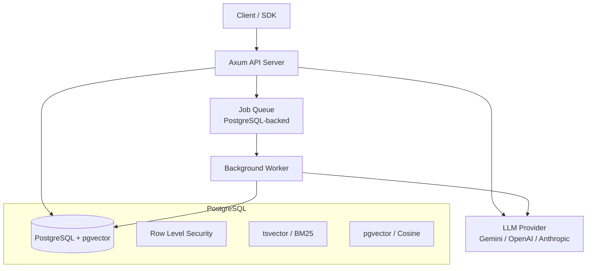
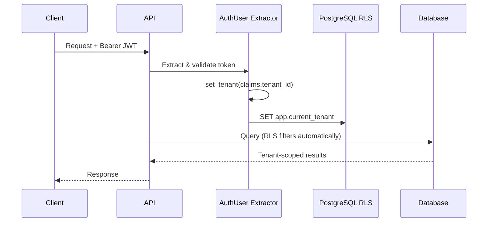
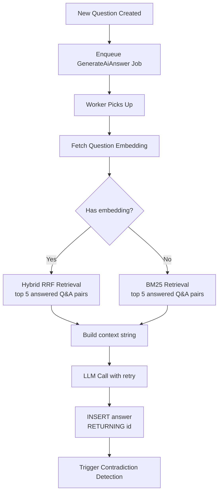
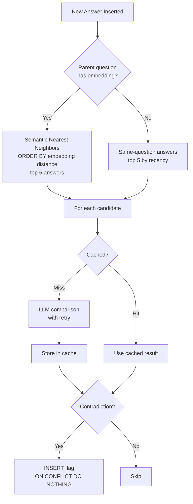
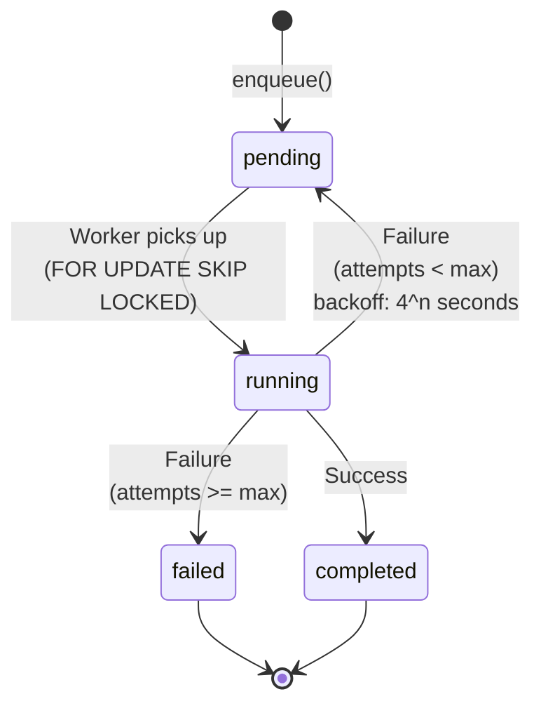
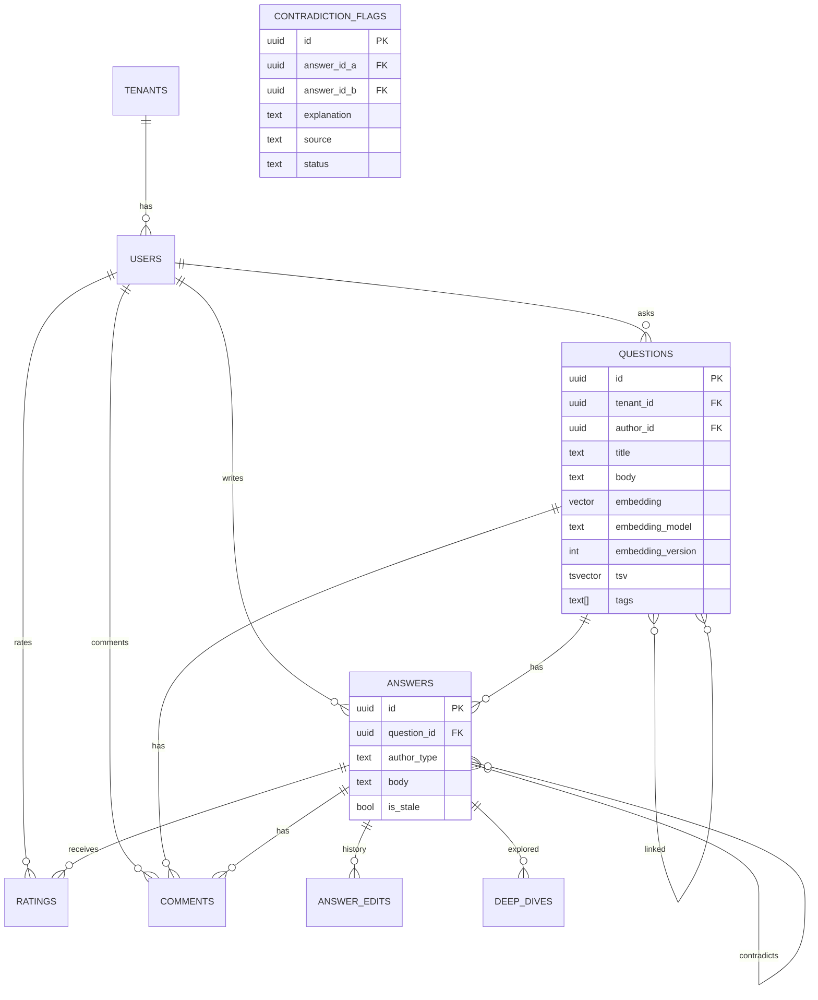
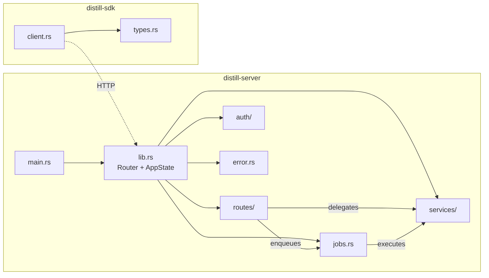
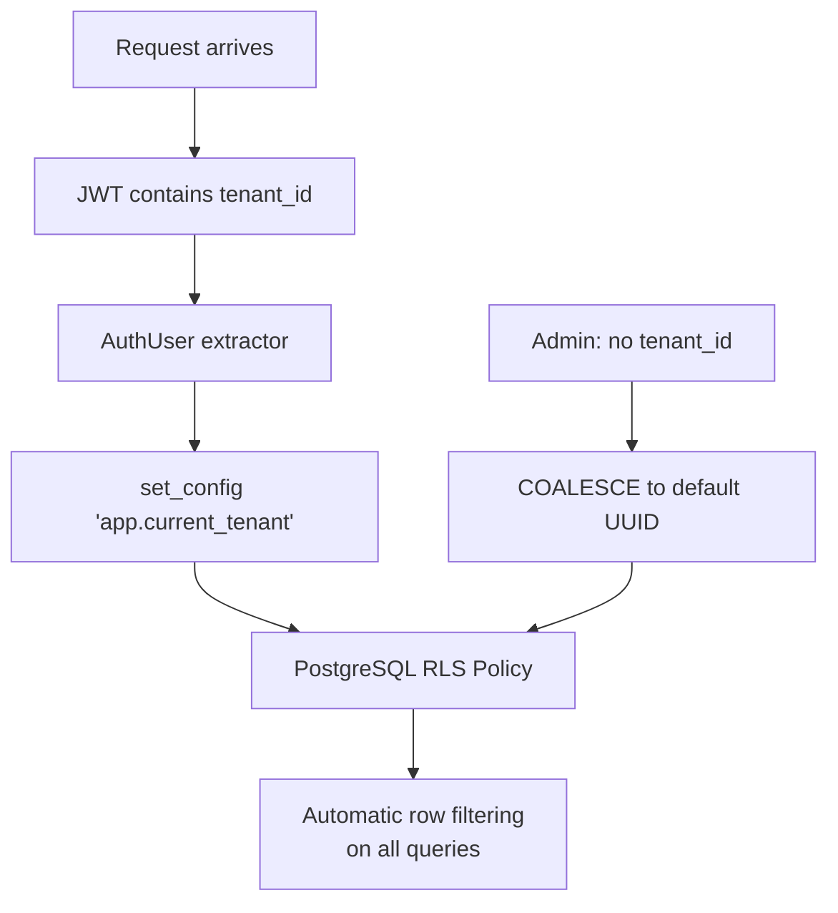

# Architecture

## System Overview

## Request Flow

## Retrieval Pipeline

```mermaid
flowchart TD
    Q[Query Text] --> EMB{Embedding<br/>available?}
    EMB -->|Yes| HYBRID[Hybrid Search]
    EMB -->|No / Timeout| KW[Keyword Only]

    HYBRID --> BM25[BM25 via tsvector<br/>top 100]
    HYBRID --> VEC[Vector via pgvector<br/>top 100]
    BM25 --> RRF[Reciprocal Rank Fusion<br/>k=60]
    VEC --> RRF
    RRF --> RESULTS[Ranked Results]

    KW --> BM25_ONLY[BM25 via tsvector<br/>ts_rank]
    BM25_ONLY --> RESULTS

    RESULTS --> RETURN[Return to caller]

    style RRF fill:#f9f,stroke:#333
```

## AI Answer Generation

## Contradiction Detection

## Job Queue Lifecycle

## Data Model

## Module Structure

## Multi-Tenancy

