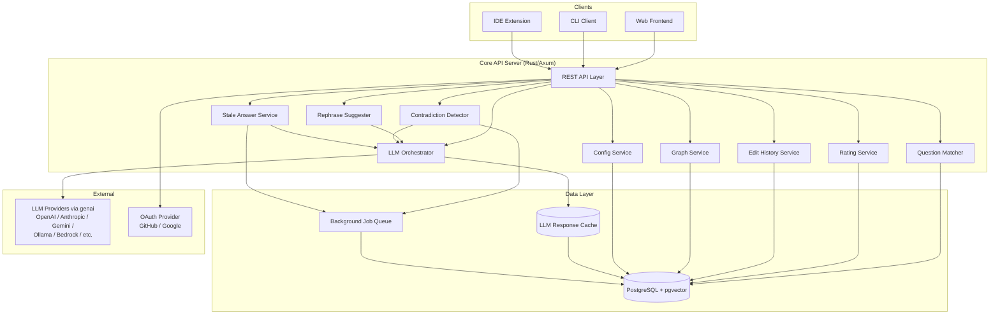
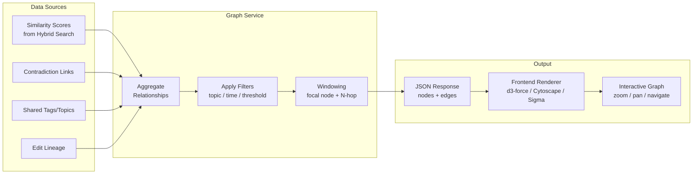

# Distill — Implementation Plan

> **Note:** This is the original design document created before implementation. For current API reference and setup instructions, see [README.md](../README.md). For contributor guidelines, see [CONTRIBUTING.md](../CONTRIBUTING.md). The implementation may differ from this plan in details — this document is kept for historical context and architectural rationale.

## Overview

Distill is a configurable community Q&A platform with intelligent question deduplication, transparent ratings, AI-generated answers with human refinement, and LLM-powered contradiction detection. It surfaces existing knowledge before creating new entries, saves every query to improve future matching, and visualizes the knowledge topology as an interactive graph.

## Core Value Proposition

When someone asks a question, Distill:
1. Finds existing matches using hybrid search (semantic + keyword)
2. Suggests better phrasing for the query
3. Surfaces related questions
4. Stores the new query to improve future matching for others
5. Generates an AI answer from existing KB context (configurable)
6. Lets users rate answers with full transparency (rater's original query + context visible publicly)
7. Detects contradictions between answers and flags them for human review
8. Allows users to ask the LLM to "dig deeper" on any answer
9. Displays an Obsidian-style visual knowledge graph of interconnections

## Architecture



## Tech Stack

| Layer | Choice | Rationale |
|-------|--------|-----------|
| Web framework | **Axum** | Modern, Tokio-native, Tower middleware ecosystem, most popular Rust web framework in 2026 |
| Database | **PostgreSQL + pgvector** | Unified storage for relational data + vector embeddings; supports hybrid BM25 + vector search via RRF in one system |
| Query layer | **sqlx** | Compile-time checked queries, async, direct raw SQL control for complex RRF/pgvector queries. ORM would fight us here. |
| Full-text search | **PostgreSQL tsvector/tsquery** | Native BM25-style ranking, no extra infrastructure |
| Vector search | **pgvector (HNSW index)** | Cosine similarity on embeddings, same DB as relational data |
| Search fusion | **Reciprocal Rank Fusion (RRF)** | Merges BM25 + vector results with k=60 |
| LLM integration | **genai** | Native-protocol multi-provider support (25+ providers: OpenAI, Anthropic, Gemini, Ollama, Bedrock, Groq, DeepSeek, etc.). Single crate for all chat/completion needs. |
| Embeddings | **genai** (if supported) or thin reqwest wrapper against OpenAI-compatible embeddings endpoint | Provider-flexible embedding generation |
| Auth | **oauth2 crate** | OAuth2 flow (GitHub, Google) |
| Diff computation | **diffy-imara** | 10-30x faster than `similar` (imara-diff backend with git/gnu-diff heuristics), unified diff output, patch parsing/applying, three-way merge — all built-in |
| Background jobs | **tokio tasks + PostgreSQL-backed queue** | Async job processing for AI answers, contradiction detection |
| Client SDK | **Rust crate** (MVP), TypeScript package (future) | Thin typed client wrapping all API endpoints |

## Configuration Philosophy

Distill is a single product that behaves differently based on deployment configuration:

- **Scope:** General-purpose, project-scoped, or domain-specific (configured at deploy time)
- **Answer mode:** AI-first (default), community-only, or hybrid
- **Search mode:** Hybrid (semantic + keyword) or keyword-only
- **Rating scale:** 1-5, 1-10, or thumbs up/down
- **Live suggestions:** Enabled or disabled (always shows matches at submission time regardless)
- **External sources:** LLM can use only internal KB, or also fetch external docs/web
- **Graph visibility:** Public or admin-only

## Pagination

All list endpoints are paginated. Two strategies used depending on context:

**Cursor-based (default for chronological lists):**
- Uses `created_at` + `id` as composite cursor (handles ties)
- Params: `?limit=20&after=<cursor>`
- Response:
  ```json
  {
    "data": [...],
    "next_cursor": "abc123",
    "has_more": true
  }
  ```
- Stable under concurrent inserts/deletes — no duplicates or skipped items
- Used by: `GET /questions`, `GET /answers/:id/ratings`, `GET /answers/:id/history`, `GET /answers/:id/deep-dives`, `GET /admin/contradictions`

**Offset-based (for ranked/scored results):**
- Params: `?limit=20&offset=0`
- Search results are a point-in-time snapshot, so offset is acceptable
- Used by: `GET /questions/search`, `GET /graph` (windowed)

**Defaults:** limit=20, max=100 (configurable per deployment)
**Sorting:** Endpoints support `?sort_by=created_at&order=desc` where applicable

## Knowledge Graph — Data Flow



**Node types:** Questions, Answers, Topics/Tags
**Edge types:** question→answer, question→similar_question, answer→contradicts_answer, question→topic
**Sizing:** Nodes scale by rating count / view count / connection count
**Thickness:** Edges scale by similarity strength

---

## Database Schema (Core Tables)

All tables include a `tenant_id` column (unused in MVP, future-proofs for multi-tenancy).

- **users** — id, tenant_id, provider, provider_id, email, display_name, avatar_url, role (user/admin), created_at
- **questions** — id, tenant_id, author_id, title, body, original_query, embedding (vector), tsvector, tags, metadata (JSONB — software version, environment, language, etc.), status, created_at, updated_at
- **answers** — id, tenant_id, question_id, author_id, author_type (human/ai), body, embedding (vector), is_stale, stale_reason, stale_marked_by, created_at, updated_at
- **answer_edits** — id, answer_id, editor_id, diff (unified diff text), edit_message, created_at
- **ratings** — id, answer_id, rater_id, score, scale_type, comment, tags, rater_original_query, created_at
- **contradiction_flags** — id, answer_id_a, answer_id_b, explanation, source (auto/user), flagged_by, status (pending/reviewed/dismissed), detected_at, reviewed_by, reviewed_at
- **deep_dives** — id, answer_id, requester_id, prompt, response, context_sources, created_at
- **llm_cache** — id, cache_key (content hash), operation_type, response, created_at, expires_at
- **config** — id, tenant_id, key, value, updated_at

## Authentication & Multi-tenancy

- **MVP:** Single-tenant, OAuth2 (GitHub as first provider, Google as second)
- **Session management:** JWT-based tokens
- **Roles:** user, admin
- **Future:** Multi-tenant isolation using `tenant_id` already present in schema

## Rating System

- Rating is **mandatory** if user chooses to give feedback (can skip entirely)
- Comment and tags are **optional** (nice for more context, but rating alone is sufficient)
- Scale is configurable per deployment: 1-5, 1-10, or thumbs up/down
- **Transparency:** Each rating stores and publicly displays:
  - The rater's original query (what they searched to arrive at this answer)
  - The score
  - Optional comment
  - Optional tags (e.g., "solved my exact problem", "partially helpful", "outdated", "wrong for my case")
- This prevents users from being swayed by aggregate ratings without understanding the rater's context

## Edit History

- GitHub-style full diffs stored for every edit
- Timeline view: who edited, when, with what edit message
- Diffs computed using the `diffy-imara` crate (unified diff format, imara-diff backend for performance)
- Supports patch parsing and applying — any version is reconstructable from the diff chain
- Three-way merge capability available for future concurrent editing support
- Current answer is always the latest version

## Contradiction Detection

- **Automatic trigger:** Background job on new answer creation or edit
- **User-raised:** Users can manually flag an answer as contradicting another via `POST /answers/:id/flag-contradiction` (providing the conflicting answer ID + explanation)
- **Method:** LLM compares answer against related answers to same/similar questions
- **On detection:**
  - Creates a `contradiction_flag` linking the two conflicting items
  - **Visible to users:** "This answer may conflict with [other answer]" shown on the answer
  - **Review queue:** Added to admin review queue at `GET /admin/contradictions`
- **Caching:** LLM contradiction results cached to avoid re-checking unchanged answer pairs
- **Resolution:** Admin can dismiss (false positive) or confirm + leave the flag visible

## Stale/Deprecated Answers

- Users can mark an answer as **stale/deprecated** via `POST /answers/:id/mark-stale` (with optional reason, e.g., "applies to v2.x only, we're on v4 now")
- Stale answers display a visible indicator and the reason
- **LLM auto-resolution (configurable):** When an answer is marked stale, the system can optionally trigger an LLM job to generate an updated version based on current KB context + the staleness reason. This is configurable via `stale_auto_resolve: true|false` in admin config.
- Admin can confirm staleness, dismiss it, or approve the LLM-generated update
- Stale status factors into search ranking (deprioritized but not hidden)

## "Dig Deeper" Feature

- User can ask the LLM to elaborate on any answer
- LLM receives: original question, current answer, related KB content, user's follow-up prompt
- If external sources enabled: also fetches external docs/web content
- Response stored as a supplementary "deep dive" (not an edit to the answer)
- All deep dives for an answer are publicly viewable

## Question Metadata

- Questions support a `metadata` JSONB field for structured context: software version, environment, OS, language/framework version, etc.
- Metadata is used in search matching (questions with matching metadata rank higher)
- Displayed alongside the question so answers can be interpreted in context
- Configurable metadata schema per deployment (admin defines which fields are available/required)

## LLM Token Cost Control

- **Response caching:** All LLM responses are cached in `llm_cache` table, keyed by a content hash of the input. Before making any LLM call, check cache first.
- **Reuse existing responses:** When a user triggers "dig deeper" or contradiction check, if a sufficiently similar request has been processed before, offer the cached response instead of generating a new one.
- **Configurable cache TTL:** Admin sets how long cached LLM responses remain valid.
- **Stale resolution reuse:** If an answer marked stale is similar to a previously resolved stale answer, reuse that resolution as a starting point.
- **Token budget:** Optional per-deployment token budget config. When budget is exhausted, LLM features gracefully degrade (serve cached responses only, queue requests for later).

## PII Redaction & Account Deletion

- **Rating PII redaction:** Users can redact their `rater_original_query` and `comment` from any rating they've left via `PUT /answers/:id/ratings` (setting fields to null). This exists because the original query and comment may contain PII or sensitive context the user later wants removed.
- **Account deletion:** Users can delete their account via `DELETE /me`. This:
  - Anonymizes all their contributions (display name → "Deleted User", nullifies email, avatar)
  - Removes `rater_original_query` and `comment` from all their ratings (scores preserved for integrity)
  - Nullifies `flagged_by` on contradiction flags they raised
  - Keeps questions/answers intact with anonymized attribution (content is community knowledge)
  - Deletes the user record and invalidates their JWT
  - Irreversible

## Visual Knowledge Graph

- Obsidian-style interactive force-directed graph
- **Nodes:** Questions, answers, topics/tags
- **Edges:** question→answer, question→similar_question, answer→contradicts_answer, question→topic
- **Edge sources:** Similarity scores (from hybrid search), contradiction links, shared tags, edit lineage
- **Node sizing:** Number of ratings, view count, connection count
- **Edge thickness:** Similarity strength
- **API endpoints:**
  - `GET /graph` — full graph (with filters: topic, time range, similarity threshold)
  - `GET /graph/node/:id` — local 2-hop neighborhood subgraph for focused exploration
- **Pagination/windowing:** For large KBs, return subgraph around a focal node
- **Frontend rendering:** d3-force, Cytoscape.js, or Sigma.js (decision deferred to web frontend implementation)

---

## Task Breakdown

### Task 1: Project Scaffolding and Database Schema

**Objective:** Set up the Rust workspace, configure Axum with basic health check, set up PostgreSQL with migrations, and define the core schema.

**Implementation guidance:**
- Cargo workspace with `distill-server` and `distill-sdk` crates
- Schema tables as defined above (users, questions, answers, answer_edits, ratings, contradiction_flags, deep_dives, config)
- All tables include `tenant_id` column
- Use sqlx migrations
- Docker Compose for local PostgreSQL + pgvector
- Basic Axum server with health check endpoint

**Test requirements:** Integration test that runs migrations and verifies schema exists; health check endpoint test.

**Demo:** Server starts, connects to DB, returns 200 on `GET /health`.

---

### Task 2: User Authentication with OAuth

**Objective:** Implement OAuth2 login (GitHub as first provider), session management, and a `GET /me` endpoint.

**Implementation guidance:**
- `oauth2` crate for the OAuth flow
- JWT-based session tokens
- Middleware extractor for authenticated routes
- User record created on first login
- Roles: user, admin

**Test requirements:** Unit test for token validation; integration test for full OAuth callback flow (mocked provider).

**Demo:** User can log in via GitHub OAuth and see their profile at `GET /me`.

---

### Task 3: Question Submission and Storage

**Objective:** Implement `POST /questions` that stores the question with its original query text, generates an embedding, and indexes it for full-text search.

**Implementation guidance:**
- Accept `title` + `body` + optional `tags` fields
- Store `original_query` verbatim (the raw text as typed by the user)
- Generate embedding via LLM service (async-openai embeddings endpoint)
- Store embedding in pgvector column
- Generate and store tsvector for full-text search
- Return the created question

**Test requirements:** Integration test: submit a question, verify it's stored with embedding and tsvector populated.

**Demo:** User submits a question via API, question is stored and retrievable via `GET /questions/:id`.

---

### Task 4: Hybrid Search and Question Matching

**Objective:** Implement `GET /questions/search?q=...` that performs hybrid BM25 + vector search using RRF to find similar existing questions.

**Implementation guidance:**
- Full-text search via `ts_rank` on tsvector column
- Vector similarity via `<=>` (cosine distance) on pgvector column
- Merge results using Reciprocal Rank Fusion (RRF, k=60)
- Return ranked list of similar questions with similarity scores
- Configuration flag to enable/disable vector search (fallback to keyword-only mode)

**Test requirements:** Seed DB with known questions; verify that semantically similar queries match; verify keyword queries match; verify RRF ranking combines both signals correctly.

**Demo:** Search for a question, get ranked list of similar existing questions with scores.

---

### Task 5: Query Rephrase Suggestions and Submission Flow

**Objective:** At submission time, show the user matching questions and suggest better phrasing before creating the question. Optionally support live suggestions.

**Implementation guidance:**
- `POST /questions/preview` endpoint: takes the draft question, returns:
  - (a) top matching existing questions (from Task 4's search)
  - (b) a rephrased/improved version of the query (via LLM)
- User can then choose to: view an existing answer, adopt the rephrase, or submit as-is
- `POST /questions` gains a `confirmed: true` flag to finalize submission after preview
- Config option for live suggestions (polling-based for MVP; WebSocket deferred to future)

**Test requirements:** Test that preview returns matches and a rephrase; test that confirmed submission creates the question.

**Demo:** User submits draft → gets "Did you mean…" suggestions + rephrased version → confirms → question created.

---

### Task 6: AI-Generated Answers

**Objective:** When a new question is created, automatically generate an initial AI answer from the LLM using relevant context from the knowledge base.

**Implementation guidance:**
- On question creation, trigger async background job to generate answer
- Gather context: similar existing Q&A pairs (from Task 4's search), configured external sources if enabled
- Call LLM with context + question to generate answer
- Store as an answer with `author_type: "ai"` and link to question
- Configurable: can disable AI answers (admin setting for "community-only" mode)

**Test requirements:** Integration test: create question → verify AI answer is generated and stored. Mock LLM for deterministic tests.

**Demo:** Submit a question → AI answer appears automatically within seconds.

---

### Task 7: Answer Editing with Full Diff History

**Objective:** Users can edit answers, with every edit stored as a diff. Timeline view shows who edited what and when.

**Implementation guidance:**
- `PUT /answers/:id` accepts new content and optional edit message
- Computes diff between old and new content using `diffy-imara` crate (unified diff format, configurable algorithm: Myers or Histogram)
- Stores diff in `answer_edits` table with editor_id, timestamp, edit_message
- `GET /answers/:id/history` returns chronological list of edits with diffs
- Current answer content is always the latest version (stored directly on the answer row)
- Any prior version can be reconstructed by applying patches in sequence (diffy-imara supports patch apply)

**Test requirements:** Edit an answer multiple times; verify diffs are correct; verify history endpoint returns all edits in order with correct attributions.

**Demo:** Edit an answer → view edit history showing unified diffs, authors, and timestamps.

---

### Task 8: Rating System with Transparency

**Objective:** Users can rate answers. Rating is mandatory (if giving feedback), comment and tags are optional. Ratings are publicly visible with the rater's original query context.

**Implementation guidance:**
- `POST /answers/:id/ratings` — accepts:
  - `score` (required) — interpreted per deployment's configured scale
  - `comment` (optional)
  - `tags` (optional array, e.g., "solved my exact problem", "partially helpful", "outdated", "wrong for my case")
- Stores the rater's original query (what they searched to find this answer) alongside the rating
- `GET /answers/:id/ratings` returns all ratings with rater's original query, comment, tags
- Aggregate scores available on answer object (average, count, distribution)
- Rating scale configurable per deployment (1-5, 1-10, thumbs up/down)

**Test requirements:** Rate an answer; verify rating stored with context; verify public listing shows rater's original query; verify aggregate scores compute correctly.

**Demo:** Rate an answer → view all ratings publicly, seeing what each rater was originally searching for.

---

### Task 9: Contradiction Detection and Flagging

**Objective:** Detect contradictions between answers, flag them visibly to users, and queue them for human review.

**Implementation guidance:**
- Background job triggered on new answer creation or answer edit
- Compare answer against related answers to the same/similar questions
- Use LLM to detect logical contradictions (prompt: "Do these two answers contradict each other? If so, explain how.")
- If contradiction detected:
  - Create `contradiction_flag` record linking the two conflicting answers with an explanation
  - Flag is **visible to users** on the answer: "⚠️ This answer may conflict with [other answer]"
  - Flag is added to **admin review queue** at `GET /admin/contradictions`
- Cache LLM contradiction check results (keyed by answer content hashes) to avoid re-checking unchanged pairs
- Admin can dismiss (false positive) or confirm the contradiction

**Test requirements:** Create two contradicting answers to similar questions; verify contradiction is detected and flagged; verify review queue shows it; verify dismissal removes user-facing flag.

**Demo:** Two conflicting answers exist → system flags the contradiction → users see warning → admin sees it in review queue and can resolve it.

---

### Task 10: "Dig Deeper" LLM Feature

**Objective:** Users can ask the LLM to elaborate on an answer, pull in more context, or explore related topics.

**Implementation guidance:**
- `POST /answers/:id/dig-deeper` — accepts a follow-up question/prompt from the user
- LLM receives: original question, current answer, related KB content (similar Q&As), user's follow-up prompt
- If configured for external sources: also searches external docs/web (basic URL fetch for MVP)
- Returns enriched response (stored as a "deep dive" — not an edit to the answer)
- `GET /answers/:id/deep-dives` returns all dig-deeper results for an answer (publicly viewable)

**Test requirements:** Request dig-deeper on an answer; verify LLM is called with proper context; verify response is stored and retrievable.

**Demo:** User clicks "Dig Deeper" on an answer → gets expanded explanation with additional context from KB and optionally external sources.

---

### Task 11: Configuration System and Admin Endpoints

**Objective:** Implement the deployment configuration system that controls platform behavior.

**Implementation guidance:**
- `config` table with key-value pairs + typed access layer in Rust
- `GET /admin/config` — returns all current config (admin-only)
- `PUT /admin/config` — update config values (admin-only)
- Config keys:
  - `rating_scale`: "1-5" | "1-10" | "thumbs"
  - `answer_mode`: "ai-first" | "community-only" | "hybrid"
  - `search_mode`: "hybrid" | "keyword-only"
  - `live_suggestions`: true | false
  - `external_sources`: true | false
  - `graph_visibility`: "public" | "admin-only"
  - `stale_auto_resolve`: true | false
  - `llm_cache_ttl_hours`: integer
  - `token_budget_monthly`: integer | null (null = unlimited)
- Middleware reads config and makes it available to request handlers
- Config changes take effect immediately (no restart required)

**Test requirements:** Set config → verify affected endpoints change behavior (e.g., set `answer_mode=community-only` → no AI answer generated on question creation; set `search_mode=keyword-only` → vector search disabled).

**Demo:** Admin changes config → system behavior adapts immediately.

---

### Task 12: Visual Knowledge Graph

**Objective:** Display an Obsidian-style interactive graph showing how questions, answers, and topics are interconnected.

**Implementation guidance:**
- `GET /graph` endpoint returns nodes and edges:
  - **Nodes:** questions, answers, topics/tags
  - **Edges:** question→answer, question→similar_question, answer→contradicts_answer, question→topic
- Edges derived from: similarity scores (Task 4), contradiction links (Task 9), shared tags/topics, edit lineage
- Support filters: by topic, by time range, by minimum similarity threshold
- Pagination/windowing for large graphs (return subgraph around a focal node)
- `GET /graph/node/:id` returns a local 2-hop neighborhood subgraph for focused exploration
- Node sizes reflect: number of ratings, view count, number of connections
- Edge thickness reflects: similarity strength
- Frontend renders with a force-directed graph library (d3-force, Cytoscape.js, or Sigma.js — decided during web frontend implementation)

**Test requirements:** Seed DB with interconnected questions; verify graph endpoint returns correct nodes/edges; verify local subgraph returns proper 2-hop neighborhood; verify filters work correctly.

**Demo:** Hit the graph endpoint → get JSON structure of nodes and edges representing the knowledge topology; frontend renders it as an interactive, zoomable, navigable graph.

---

### Task 13: Client SDK and Integration Wiring

**Objective:** Build the thin Rust client SDK crate and ensure the full flow works end-to-end.

**Implementation guidance:**
- `distill-sdk` crate: typed client wrapping all API endpoints
- Handles auth token management (login, token refresh)
- Methods: `login()`, `search_questions()`, `preview_question()`, `submit_question()`, `get_answer()`, `rate_answer()`, `dig_deeper()`, `get_graph()`, etc.
- Error types matching API errors
- Integration test using the SDK against a running server (test harness spins up server)

**Test requirements:** End-to-end test: login → search → submit question → get AI answer → rate it → dig deeper → view graph — all via SDK.

**Demo:** Full user journey works via SDK: ask a question, get matched to existing ones, submit, get AI answer, rate it, dig deeper, view knowledge graph.

---

## Project Structure

```
distill/
├── Cargo.toml                  (workspace)
├── docker-compose.yml          (PostgreSQL + pgvector)
├── .env.example
├── PLAN.md
│
├── distill-server/
│   ├── Cargo.toml
│   ├── src/
│   │   ├── main.rs
│   │   ├── config.rs           (deployment config)
│   │   ├── db.rs               (connection pool)
│   │   ├── auth/
│   │   │   ├── mod.rs
│   │   │   ├── oauth.rs
│   │   │   └── middleware.rs
│   │   ├── routes/
│   │   │   ├── mod.rs
│   │   │   ├── questions.rs
│   │   │   ├── answers.rs
│   │   │   ├── ratings.rs
│   │   │   ├── graph.rs
│   │   │   └── admin.rs
│   │   ├── services/
│   │   │   ├── mod.rs
│   │   │   ├── search.rs       (hybrid search + RRF)
│   │   │   ├── rephrase.rs     (query rephrase via LLM)
│   │   │   ├── ai_answer.rs    (AI answer generation)
│   │   │   ├── edit_history.rs (diff computation)
│   │   │   ├── contradiction.rs(contradiction detection + user flags)
│   │   │   ├── stale.rs        (stale/deprecated marking + auto-resolve)
│   │   │   ├── dig_deeper.rs   (dig deeper feature)
│   │   │   └── graph.rs        (knowledge graph builder)
│   │   ├── llm/
│   │   │   ├── mod.rs
│   │   │   ├── client.rs       (genai multi-provider wrapper)
│   │   │   ├── cache.rs        (LLM response cache + reuse)
│   │   │   └── embeddings.rs
│   │   ├── models/
│   │   │   ├── mod.rs
│   │   │   ├── user.rs
│   │   │   ├── question.rs
│   │   │   ├── answer.rs
│   │   │   ├── rating.rs
│   │   │   └── contradiction.rs
│   │   └── jobs/
│   │       ├── mod.rs
│   │       ├── ai_answer.rs
│   │       ├── contradiction.rs
│   │       └── stale_resolve.rs
│   └── migrations/
│       ├── 001_create_users.sql
│       ├── 002_create_questions.sql
│       ├── 003_create_answers.sql
│       ├── 004_create_answer_edits.sql
│       ├── 005_create_ratings.sql
│       ├── 006_create_contradiction_flags.sql
│       ├── 007_create_deep_dives.sql
│       ├── 008_create_llm_cache.sql
│       └── 009_create_config.sql
│
├── distill-sdk/
│   ├── Cargo.toml
│   └── src/
│       ├── lib.rs
│       ├── client.rs
│       ├── types.rs
│       └── error.rs
│
└── tests/
    └── integration/
        ├── health.rs
        ├── auth.rs
        ├── questions.rs
        ├── search.rs
        ├── answers.rs
        ├── ratings.rs
        ├── contradictions.rs
        ├── dig_deeper.rs
        ├── graph.rs
        └── e2e.rs
```

## MVP Scope

The MVP delivers Tasks 1–13 as a single-tenant API server with:
- Full question lifecycle (submit → match → rephrase → confirm)
- AI-generated answers with community editing and diff history
- Hybrid search (configurable)
- Transparent rating system
- Contradiction detection with dual flagging (user-visible + admin queue)
- "Dig Deeper" LLM feature
- Visual knowledge graph API
- Rust client SDK
- OAuth authentication (GitHub)
- Configurable deployment behavior via admin endpoints

## Future Work (Post-MVP)

- Multi-tenancy (activate `tenant_id` isolation)
- Web frontend (React/Svelte + graph visualization)
- CLI frontend (using distill-sdk)
- VS Code / IDE extension
- WebSocket for live suggestions
- Additional OAuth providers (Google, GitLab)
- Webhooks for external integrations
- Export/import (migration between instances)
- Analytics dashboard (popular questions, resolution rates, rating trends)
- Moderation tools (spam detection, user bans)
- API rate limiting and usage quotas
